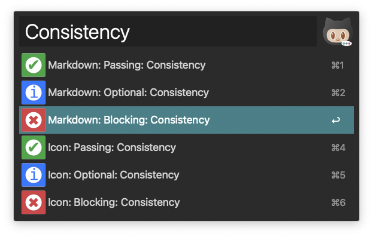

# Github Label Builder

This application renders SVG Labels for my use in Github Pull Request comments.

## Usage

### Github Markdown (Difficulty Level 2)
```

What do you think of calling this variable `subscribedTopics` or something like that, just to make it more explicit?
```
> 
>
> What do you think of calling this variable `subscribedTopics` or something like > that, just to make it more explicit?


```

I would recommend we do the `console.error` BEFORE we save it to the database. That way, if the DB save also fails, we can capture both failures.
```
> 
>
> I would recommend we do the `console.error` BEFORE we save it to the database. That way, if the DB save also fails, we can capture both failures.

```

If you don't `return await` here, you're not going to catch it in your `catch` here.
```
> 
>
> If you don't `return await` here, you're not going to catch it in your `catch` here.

```

I really like the way you did this. Awesome!
```
> 
>
> I really like the way you did this. Awesome!

### Alfred Workflow (Difficulty Level 1)
If you use Alfred, I created a workflow that will compose the Markdown for you. Simply download and install the [Github PR Labels.alfredworkflow](Github%20PR%20Labels.alfredworkflow) in this repository.



---

## OK, why did you make this?

In working through my fair share (and then some) of Pull Requests, I found that it because convient for me to quantify my asks, so that the person on the other end of the request understood when I was _asking_, when I was _telling_, and especially when I was doing some of both. I ended up with PRs Requesting Changes, with a mixture of comments like these:


> [non-blocking]
>
> Can you change this into a Unit Test, instead of an integration test?
------
> [not-necessarily blocking]
>
> What do you plan for this GraphQL schema to evolve into? Let's chat before you merge this. I think you're on the right track, but I want to make sure.
------
> [blocking]
>
> If you don't `return await` here, you're not going to catch it in your `catch` here.

I got tired of that, and it still wasn't very easy for me to at-a-glance show what was blocking and what wasn't. This was especially troublesome in very large Pull Requests (I know, we shouldn't have those, but we always seem to).

### Enter Github Labels v1
I created a set of Github Labels (icons) that I could simply drop into my comments, which allowed me to quickly and succinctly describe both why I was putting the comment and how big of a deal it was:

> 
>
> What do you think of calling this variable `subscribedTopics` or something like that, just to make it more explicit?

> 
>
> I would recommend we do the `console.error` BEFORE we save it to the database. That way, if the DB save also fails, we can capture both failures.

> 
>
> If you don't `return await` here, you're not going to catch it in your `catch` here.

This was better, but I was just so frustrated that I couldn't use SVGs. Apparently, for Security Reasons, Github doesn't allow local SVGs

### Enter Github Label Builder

With this project, I was able to generate SVGs remotely, so that Github would render them properly. I can use any of the "blocking", "optional", or "passing" button types, and any text (as long as it fits)
